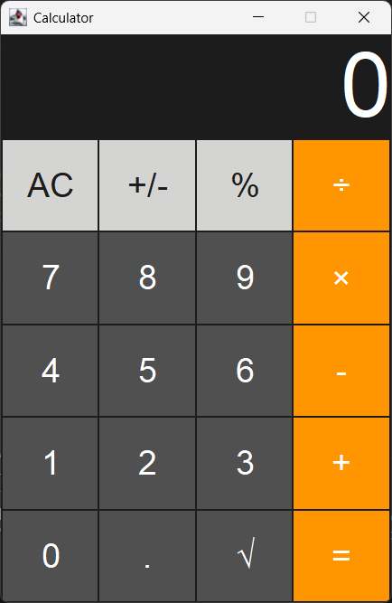

# Java Calculator Project

A simple calculator application built entirely in Java using Swing for the GUI. This project demonstrates the implementation of both frontend and backend logic using core Java.

## 🖥️ Features

- Basic arithmetic operations: Addition, Subtraction, Multiplication, Division  
- Interactive Graphical User Interface (GUI) using Java Swing  
- Input validation and error handling (e.g., divide by zero)  
- Fully standalone desktop application

## 📁 Folder Structure

```
Calculator/
├── .vscode/           # VS Code settings
├── bin/               # Compiled .class files
├── src/               # Java source code
│   └── App.java       # Main Java file with main method
├── screenshots/       # Project screenshots
├── README.md          # Project documentation
└── LICENSE            # MIT License file
```

## 🚀 Getting Started

### ✅ Prerequisites

- Java Development Kit (JDK) installed  
- IDE like VS Code, IntelliJ IDEA, or Eclipse

### 🛠️ How to Run

1. Clone the repository:
   ```bash
   git clone https://github.com/DevayaniNakarani/Calculator-Project.git
   ```

2. Navigate to the Calculator folder:
   ```bash
   cd Calculator-Project/Calculator
   ```

3. Compile:
   ```bash
   javac -d bin src/*.java
   ```

4. Run:
   ```bash
   java -cp bin App
   ```

## 📸 Screenshots



## 💻 Technologies Used

- Java  
- Swing (for GUI)  
- VS Code (for development)

## 👩‍💻 Author

**Devayani Nakarani**  
🔗 [Portfolio](https://devayani-portfolio.netlify.app)  
🐙 [GitHub](https://github.com/DevayaniNakarani)

## 🙌 Special Thanks

Thanks for checking out this project! 💖  
If you liked it, feel free to ⭐️ star it on GitHub or share it.  
Your feedback is always welcome! 🚀
